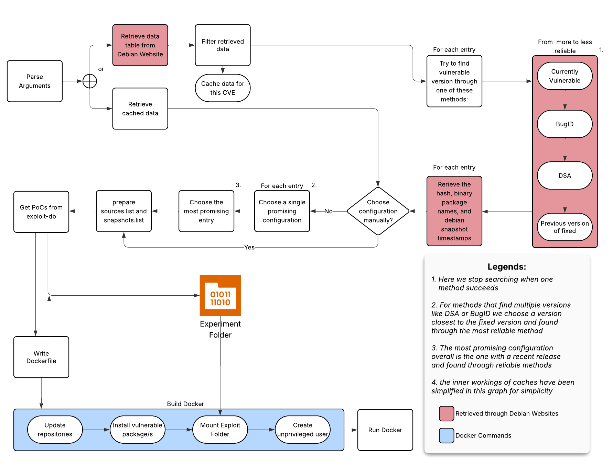

# DEbian Cve REproducer Tool 

This tool reproduces a vulnerable Debian environment for a given CVE number.  


## License 

Copyright (c) 2023-2025 Orange
This code is released under the terms of the BSD 3-Clause license. See the `license.txt` file for more information.


## Requirements

- Python3
- Docker (see the [official documentation](https://docs.docker.com/engine/install/))
- Firefox


## Build and Usage

On Debian stable, a simple way to install DECRET is to first run the
following commands as `root`:

```shell
# apt install python3 python-is-python3 python3-venv
# apt install docker.io
# apt install firefox-esr
```

Then, you can download DECRET and its dependencies in a virtual
environment (using the `venv` module):

```shell
$ git clone https://github.com/Orange-OpenSource/decret.git
$ cd decret
$ python3 -m venv venv
$ source venv/bin/activate
$ pip install -r requirements-minimal.txt
```

You can use `requirements.txt` if you want to run the tests which are
run in the Continuous Integration pipeline.

Finally you can run decret like so:

```
python3 -m decret -n 2020-7247 -r bullseye --selenium
```

and see available arguments like so:

```
python3 -m decret -h 
```

## Example

You can find examples in the `examples` directory.

## Contributing

### Structure
1. ***/decret:*** Main Python source code
2. ***/tests:*** This is where the pytest code lives
3. ***/examples:*** Markdown files illustrating working examples


### Instructions
1. Fork this repository
2. Create a new branch: `git checkout -b feature/your-feature-name`
3. Make your changes, commit, push to feature branch etc
4. Ensure tests and linters pass

Our GitHub Actions run pylint, and pytest. Run them locally if possible:
```shell
black decret tests
pylint decret tests
pytest
```
5. Verify your code passes CI tests under `.github/workflows`
6. Open pull request

## Working principle



---
Disclaimer: This project is not endorsed by, or sponsored by the Debian Project. The Debian name and logo are trademarks of Software in the Public Interest, Inc. The Debian logo is used here solely to indicate that this software is designed to use Debian-based systems, in accordance with Debian’s trademark guidelines.
